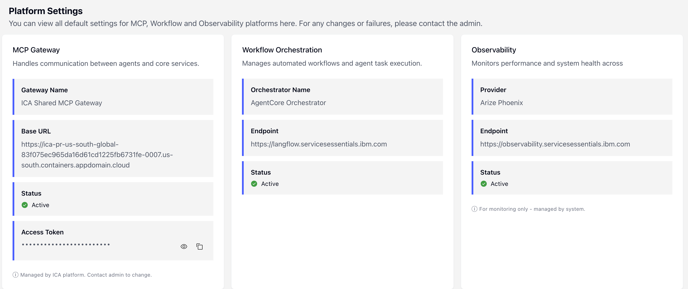

# Agentic Chat Backend with LangGraph

This is a boilerplate project for an agentic chat orchestrating agents using
LangGraph and exposing the chat API using the [A2A
protocol](https://a2a-protocol.org/latest/). The boilerplate contains two
agents - a weather agent and a food agent.

**Prerequisites:**

- Python 3.13+
- Make
- A virtual environment (recommended)
- `uv` (recommended) — used to install and run dependency-group dev tools from `pyproject.toml`

## Local Development

Install dependencies and activate the virtual environment:

```
make install
```

## Run the Application in Development Mode

```bash
make dev
```

or

```
make dev-cached
```

**Note**: Log in to your AWS account with permission to call the Bedrock LLM
models before running the command.

## Container Build + Push (AMD64-only)

The backend Makefile now uses Docker Buildx and validates architecture so only
`linux/amd64` images are produced and pushed.

```bash
cd langgraph
make build
make smoke-local
make push-ecr
```

Additional helper targets:

- `make verify-arch-local` checks local `agentic-chat-backend:latest`.
- `make verify-arch-ecr` checks pushed ECR tags for `linux/amd64`.

## Configuration

`.env` is not needed to run the application locally however you can set the
following variables in `.env`:

### ICA Integration - required ICA_* variables.
See [Visual guide](https://github.ibm.com/Consulting-DTT-AI-Integration-Services/agentstudio-external-agent-boilerplate/wiki/How-to-get-required-ICA_*-env-variables)
 for quixk start.

See the configuration described in `agentstudio-sdk` README (section **Environment Variables**) for full reference.

### Server configuration

- `ALLOWED_ORIGINS`: List of origins that can call the backend (CORS check). Format: comma-separated URLs or `*`. Example: `http://localhost:3000,https://example.com`
- `AWS_REGION`: AWS region for LLM models (e.g., `us-east-1`). Required for Bedrock integration.
- `A2A_PROTOCOL`: The protocol to be used by the backend (`JSONRPC` or `HTTP+JSON`). Defaults to `JSONRPC`.
- `PORT`: Server port. Defaults to `8000`.
- `PUBLIC_AGENT_URL`: Public URL where the agent is accessible (used for agent registration). Example: `https://agent.example.com`

### Weather agent tools

- `WA_MCP_SERVER_URL`: Optional. URL of the weather MCP server (e.g., `https://weather-mcp-server.superhighfives.workers.dev/mcp`). If unset, weather agent is skipped.
- `WA_AUTHORIZATION`: Optional. Authorization credentials for the weather MCP server (e.g., API key or bearer token).

### Rulebook AI MCP Server Configuration

The term reader and term writer agents require connection to a Rulebook AI MCP server for term management operations.

- `RULEBOOK_MCP_SERVER_URL`: **Required** for term agents - This is the Base URL of the shared MCP Gateway (you can find it in the Platform Settings). Format: `https://<MCP_GATEWAY_BASE_URL>/servers/<server-id>/mcp`
  - **Where to get it**: Log in to [IBM Enterprise Advantage Platform](https://servicesessentials.ibm.com/agenticapps), navigate to the Platform Settings (see screenshot below.)

- `RULEBOOK_BEARER_TOKEN`: **Required** for term agents. Authentication token for the Rulebook AI MCP server.
  - **Where to get it**: In the Agent Studio, go to Platform Settings and copy the MCP Gateway Access Token. **Important**: Only provide the token value without the "Bearer " prefix (it's added automatically by the code).
  - Example: `RULEBOOK_BEARER_TOKEN="your-token-here"` (not `RULEBOOK_BEARER_TOKEN="Bearer your-token-here"`)

**Note**: If these variables are not set, the term reader and term writer agents will be skipped during startup, and the system will continue with other available agents.



## Quick check

Get the agent card:

```bash
curl http://localhost:8000/.well-known/agent-card.json
```

Weather agent startup requirements:

- `WA_MCP_SERVER_URL` is optional. If unset, weather agent is skipped.
- `WA_AUTHORIZATION` is optional (warning-only when missing).

For local smoke checks you can use:

```bash
export WA_MCP_SERVER_URL=http://127.0.0.1:9/sse
```

The Makefile `smoke-local` target also performs preflight checks:

- verifies AWS identity via `aws sts get-caller-identity`
- enforces non-empty `WA_MCP_SERVER_URL`

Runtime behavior:

- If weather MCP initialization fails (missing URL, unreachable MCP server, or tool discovery failure), backend startup continues and weather is excluded from the active agent registry.

## Optional bearer token (A2A auth)

This backend supports an optional single-token bearer authentication for A2A messaging endpoints. Configure the token in your environment (for example, in `.env`):

- `A2A_BEARER_TOKEN`: when set, the server will require incoming requests to include an `Authorization: Bearer <token>` header for protected endpoints.

Keycloak JWT validation is also supported:

- `KEYCLOAK_ISSUER_URL` (or `KEYCLOAK_URL`): Keycloak realm issuer URL, for example `https://<host>/realms/<realm>`
- `KEYCLOAK_AUDIENCE` (optional): expected JWT audience (recommended in production)
- `KEYCLOAK_JWKS_URL` (optional): override JWKS URL
- `KEYCLOAK_USERINFO_URL` (optional): fallback endpoint used to validate tokens when local JWT verification fails

Behavior:

- If `A2A_BEARER_TOKEN` is not set, authentication is disabled and requests are accepted (useful for local development).
- When `A2A_BEARER_TOKEN` is set, the middleware validates the bearer token for message endpoints; discovery of the agent card (/.well-known/agent-card.json) remains public and is excluded from auth checks.

## Available Agents

The boilerplate includes the following specialized agents:

### Weather Agent

Provides weather information and forecasts using an external MCP server.

- **Capabilities**: Current weather conditions, forecasts, temperature information
- **Configuration**: Requires `WA_MCP_SERVER_URL` and optionally `WA_AUTHORIZATION`

### Meal Agent

Provides meal suggestions, recipes, and food-related assistance.

- **Capabilities**: Recipe recommendations, meal planning, cooking tips, dietary information
- **Configuration**: No external dependencies required

### Term Reader Agent (Rulebook AI)

Retrieves and searches for terms from the Rulebook AI knowledge base.

- **Capabilities**: Search terms by name or description, retrieve definitions, list available terms, query metadata
- **Routing triggers**: User queries containing "see", "get", "list", "view", "show", "find", "search" + "term(s)", or "what is", "define", "explain" + term-related keywords
- **Configuration**: Requires `RULEBOOK_MCP_SERVER_URL` and `RULEBOOK_BEARER_TOKEN`
- **Implementation**: `src/agents/term_reader.py` (subclass of `BaseAgentWithMCP`)

### Term Writer Agent (Rulebook AI)

Creates new terms in the Rulebook AI knowledge base.

- **Capabilities**: Create new term definitions, validate parameters, handle duplicate detection, provide creation confirmation
- **Routing triggers**: User queries containing "create", "add", "post", "write", "new" + "term", or "define a new", "add a definition"
- **Configuration**: Requires `RULEBOOK_MCP_SERVER_URL` and `RULEBOOK_BEARER_TOKEN`
- **Implementation**: `src/agents/term_writer.py` (subclass of `BaseAgentWithMCP`)

Both term agents support dual response formats (Azure OpenAI and AWS Bedrock) and include comprehensive error handling with user-friendly messages.

Set the value in your `.env` or export it before running the app. Example:

```bash
export A2A_BEARER_TOKEN=supersecret
```

Keycloak example:

```bash
export KEYCLOAK_ISSUER_URL=https://<keycloak-host>/realms/<realm>
# optional: export KEYCLOAK_AUDIENCE=<client-id>
```

## Hooks

This boilerplate supports runtime hooks for `session_start`, `session_end`,
`input`, `output`, `error`, `tool_call`, `tool_result`, and `tool_error`.

To enable the included example handlers:

```bash
export AGENTSTUDIO_HOOKS=hooks_example
```

The sample module lives in [hooks_example.py](/Users/kuba/Documents/Projects/Code/agentstudio-external-agent-boilerplate/langgraph/hooks_example.py).
LangGraph MCP-backed agents emit tool hooks automatically through the shared
SDK MCP adapter.

## Implementing Custom Agents

If you want to add or replace agents that handle user requests, the project exposes a simple agent API under `src/agents/`.

- Location and structure:
  - The package is at `src/agents/` and exports the agent classes from `src/agents/__init__.py`.
  - Each agent is a small module that subclasses `BaseAgent` located in `src/agents/base.py` or `BaseAgentWithMCP` located in `src/agents/base_with_mcp.py` in case of active MCP Server.

- How to add or replace an agent:
  1. Create a new module file in `src/agents/`, e.g. `src/agents/my_agent.py`.
  2. Import `BaseAgent`/`BaseAgentWithMCP` and implement `handle_message(self, state: AgentState) -> AgentState`.
     - `state` is a mapping-like object (`AgentState`) with keys such as `utterance`, `contextId`, and a place to put the agent's `response`.
     - Use `await self.generate(prompt)` to call the configured model without blocking the event loop and `self.decode_model_response(resp)` to extract text if the model returns the project's JSON response envelope.
     - In case of active MCP server, call `await self.generate(prompt)` for the tool-enabled pass. `BaseAgentWithMCP` will await async tool discovery and pass the discovered tool schema to the model. Extract requested tools with `self.extract_tool_requests(resp)`, call MCP server via `await self.call_mcp(args)`, then use `await self.generate(prompt, [])` for a no-tools follow-up response.
  3. Add your agent to the `src/agents/__init__.py` exports (or import it in `src/main.py` directly) and update `config/agents.py` to include a mapping for your agent with `model_alias` and optional `description`.

- Example (minimal agent skeleton):

  ```py
  # src/agents/my_agent.py
  from .base import BaseAgent
  from ..state import AgentState

  class MyAgent(BaseAgent):
      async def handle_message(self, state: AgentState) -> AgentState:
          utterance = state.get('utterance', '')
          prompt = f"You are MyAgent. User asked: {utterance}\nRespond concisely."
          resp_raw = await self.generate(prompt)
          state['response'] = self.decode_model_response(resp_raw)
          return state
  ```

- Example with MCP server (minimal agent skeleton):

  ```py
  # src/agents/my_agent_mcp.py
  from .base_with_mcp import BaseAgentWithMCP
  from ..state import AgentState

  class MyAgent(BaseAgentWithMCP):
      async def handle_message(self, state: AgentState) -> AgentState:
          utterance = state.get('utterance', '')
          prompt = f"You are MyAgent. User asked: {utterance}\nRespond concisely."
          resp_raw = await self.generate(prompt)
          tool_requests = self.extract_tool_requests(resp_raw)
          if tool_requests:
              tool_results_content = []
              for request in tool_requests:
                  result = await self.call_mcp({ "name": request['name'], "arguments": request['input'] })
                  tool_results_content.append({ "toolResult": { "toolUseId": request['toolUseId'], "content": [{"text": str(result['content'][0]['text'])}] } })
              resp_raw = await self.generate(f"This is the insight from the tools: {json.dumps(tool_results_content)}. Generate some response based on this insight but do not explicitly mention the JSON response.", [])
          state['response'] = self.decode_model_response(resp_raw)
          return state
  ```

- How the supervisor and routing work:
  - `src/agents/supervisor.py` contains a small classifier agent that looks at the user's `utterance` and selects which agent id should handle the request.
  - The mapping of available agents comes from `config/agents.py` and the supervisor uses that list to produce a classification prompt.

- Useful tips:
  - Keep agents focused and deterministic: if an agent must call external APIs do so in helper functions and keep `handle_message` simple.
  - Leverage `AgentState` to store intermediate values between steps; the orchestrator persists or passes the state to the chosen agent.
  - Update `tests/test_app.py` with a focused test for your new agent behavior.

If you'd like, I can scaffold a new `src/agents/<your_agent>.py` file and add a test example — tell me the agent name and a one-line description of its responsibilities.
